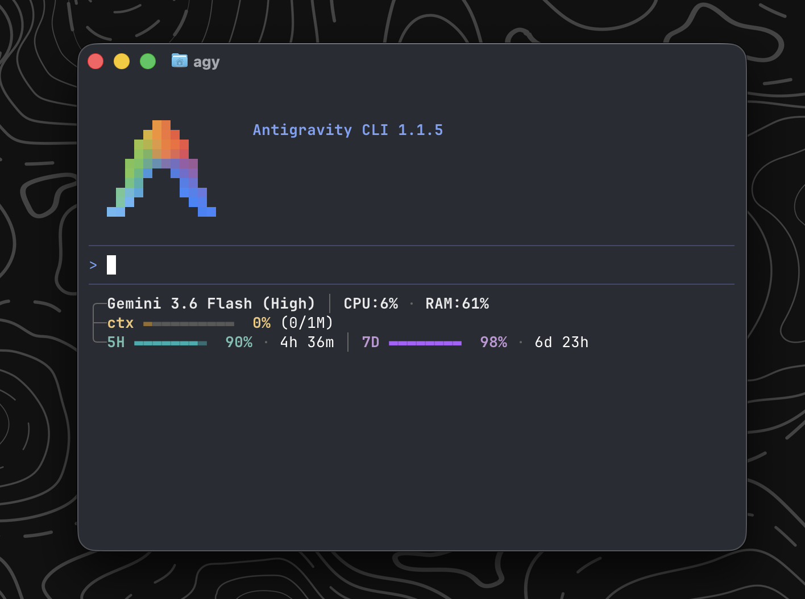
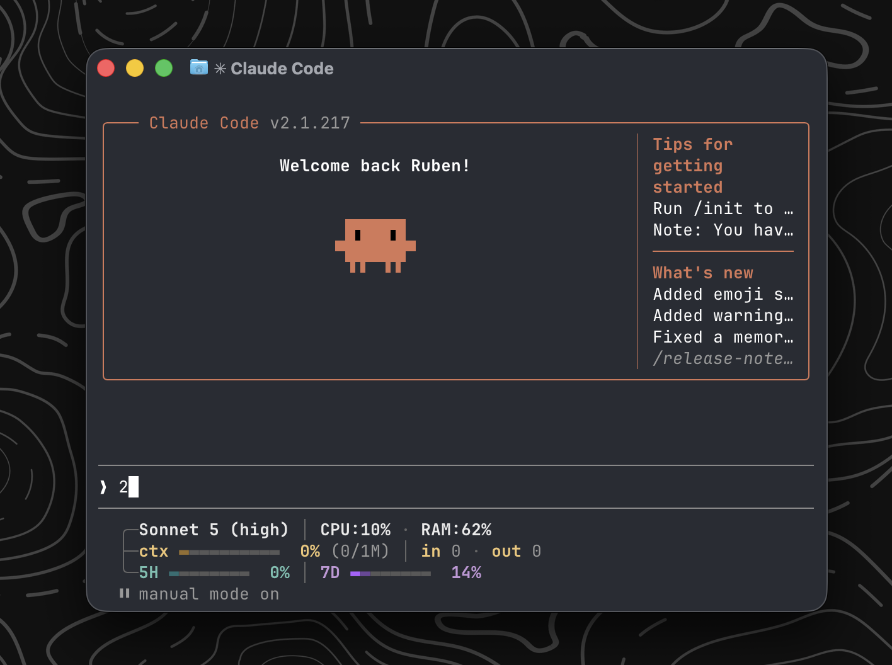

# cli-statusline

Status line for **Claude Code** (`claude`) and **Antigravity CLI** (`agy`) — displays the active model with thinking effort level, git branch, CPU load percentage, host memory (RAM), session context usage (with detailed input/output tokens), and real-time quota consumption.

---

## What it shows

The statusline renders exactly 3 lines (or 2 if quotas are not present), automatically padding elements inside a structured box frame that scales seamlessly when you resize your terminal (without elements wrapping or splitting into extra lines):

### Screenshots

| Antigravity CLI (`agy`) | Claude Code (`claude`) |
| :---: | :---: |
|  |  |

| Line | Left Side Component | Right Side Component |
|------|---------------------|----------------------|
| **Line 1** | Active Model ID / Display Name with thinking effort configured (e.g. `Sonnet 5 (high)` or `Gemini 3.6 Flash (high)`), Git branch name (`*` = uncommitted changes, green/red status), CPU percentage (`CPU:XX%`), and RAM percentage (`RAM:XX%`) (starts with `╭─`) | Empty (left-aligned ribbon) |
| **Line 2** | Context Bar & Tokens Counter: Context Bar (`ctx`), context percentage (`XX%`), raw tokens used/limit `(XXK/XXK)`, and total input/output tokens (`in XXK · out XXK`) (starts with `├─` or `╰─`) | Empty |
| **Line 3** | Quotas progress bars (`5H` & `7D`) & remaining/reset times (starts with `╰─`) | Empty |

> Quotas are automatically integrated from stdin JSON payload (Claude Code `rate_limits` or Antigravity CLI `quota`) as well as `ccstatusline` cache fallback for Claude Code. If no quota data is available, this line is cleanly omitted and the box collapses to 2 lines.

---

## Dual Compatibility (Claude Code & Antigravity CLI)

This repository provides ready-to-use statusline setups for both **Claude Code** and **Antigravity CLI**. Each tool has its own dedicated directory:

```text
cli-statusline/
├── README.md
├── claude-code/
│   ├── statusline.sh   # Main statusline script for Claude Code
│   ├── install.sh      # Installer (targets ~/.claude/)
│   └── uninstall.sh    # Uninstaller
└── antigravity/
    ├── statusline.sh   # Main statusline script for Antigravity CLI
    ├── install.sh      # Installer (targets ~/.gemini/antigravity-cli/)
    └── uninstall.sh    # Uninstaller
```

---

## Installation

### 1. Claude Code (`claude`)

To install the statusline for **Claude Code**:

```bash
git clone https://github.com/rubenalcala/cli-statusline
cd cli-statusline
bash claude-code/install.sh
```

Restart `claude` to see your status line.

### 2. Antigravity CLI (`agy`)

To install the statusline for **Antigravity CLI**:

```bash
git clone https://github.com/rubenalcala/cli-statusline
cd cli-statusline
bash antigravity/install.sh
```

Restart `agy` / Antigravity CLI to see your status line.

---

## Uninstallation

### Claude Code
```bash
bash claude-code/uninstall.sh
```

### Antigravity CLI
```bash
bash antigravity/uninstall.sh
```

---

## Color and Formatting Rules

- **CPU and RAM**: Displayed in bright white by default, turning red (`197`, matching git dirty red) when usage/load is >= 80%.
- **Context details**: `ctx`, `in` and `out` text labels are highlighted in standard yellow (`FG_YELLOW`).
- **Quota Bars**:
  - `5H`: Styled with cyan color for the label, bar, and percentage.
  - `7D`: Styled with purple color for the label, bar, and percentage.
- **Integers everywhere**: All percentage numbers and token counts are displayed as integers with no decimal places (e.g., `8%` instead of `7.5%`, `15K/200K` instead of `15.0K/200.0K`).

---

## Requirements

- [`jq`](https://jqlang.github.io/jq/) — for JSON parsing
- `git` — for branch info
- **Claude Code** (`claude`) or **Antigravity CLI** (`agy`) installed

---

## How it Works

Both `claude` and `agy` run the command configured under `statusLine` in their respective `settings.json` files:
- **Claude Code**: `~/.claude/settings.json`
- **Antigravity CLI**: `~/.gemini/antigravity-cli/settings.json`

The CLI pipes the session state as JSON via stdin. The statusline parser dynamically handles both rate limit schemas (Claude's `rate_limits.five_hour` / `rate_limits.seven_day` and Antigravity's `quota["gemini-5h"]` / `quota["gemini-weekly"]`), formatting and rendering the telemetry in real time.
